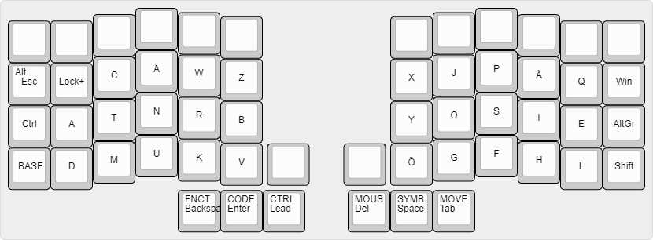
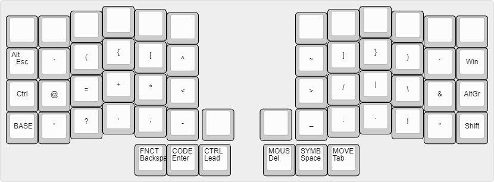
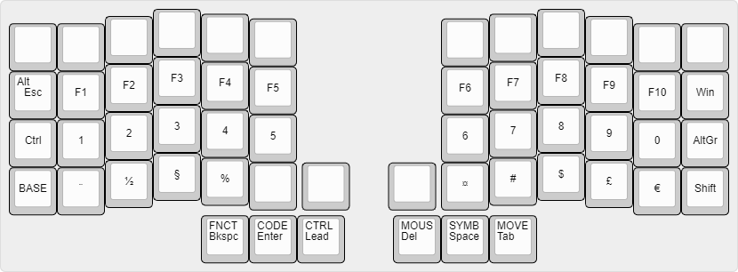
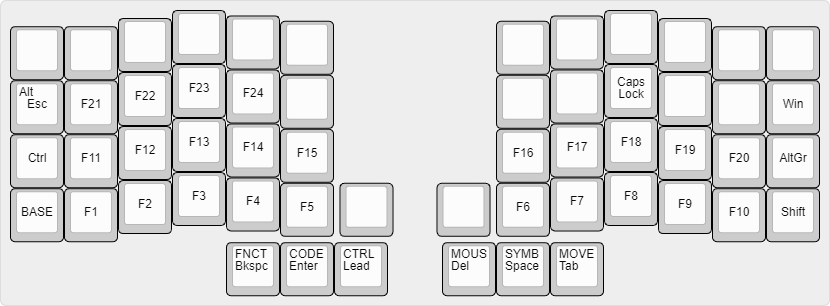
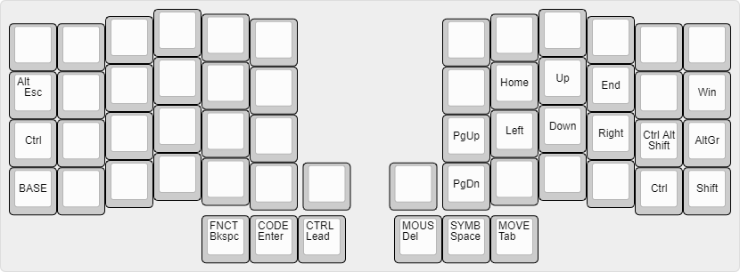
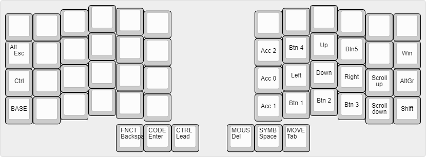
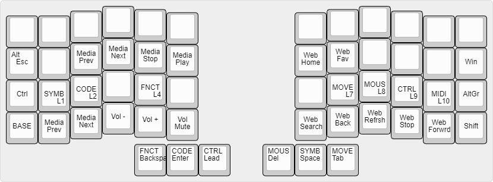

## Irisk - A swedish layout for lazy fingers
I wanted to see if it was a good idea to use a layout where movement of the writsts is traded for an extra keypress or two. So far I have not been able to test it extensively.

There main idea in its design is based on statistically informed placement of characters. The keys were assigned an "effort" score for reaching and an amalgamation of Swedish, English and programming character frequency was created. The more frequent characters were assigned to the low effort keys alternating left to right. Due to ergonomics and functional requirements some keys were placed on the thumb keys and the side keys.

It was also considered desirable to keep the layout compatible with the Crkbd keyboard. To do this seven keys from each side is ignored.

### The layers
#### How to read
The center of a key represents the symbol sent on keypress and release.

The upper left corner represents the activation of a layer or modifier key.

A layer is indicated by four capital letters.

#### Base

#### Symbols

#### Code

#### Function

#### Move

#### Mouse

#### Control

#### Stuff
Images generated using [ww.keyboard-layout-editor.com](http://www.keyboard-layout-editor.com)
