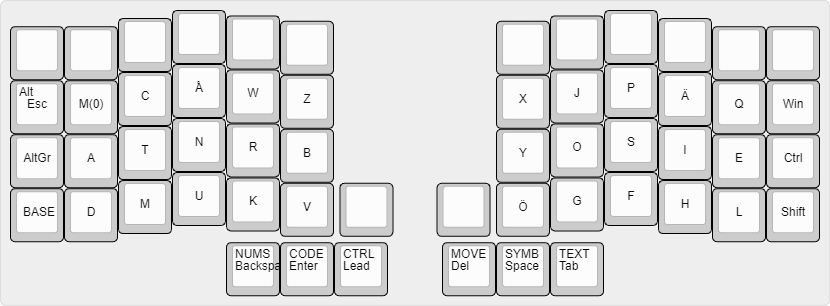
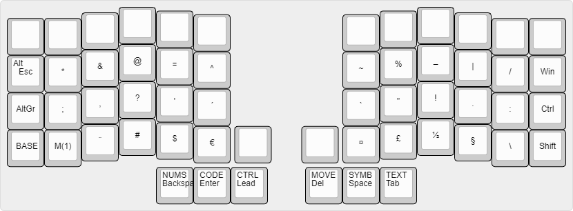
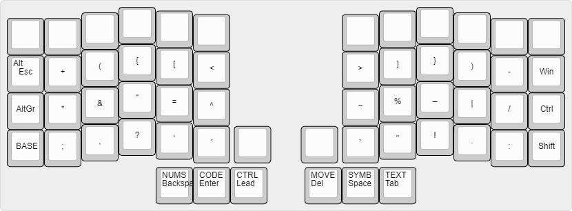
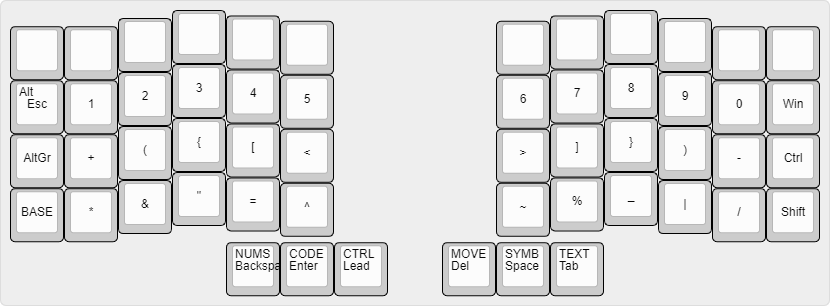
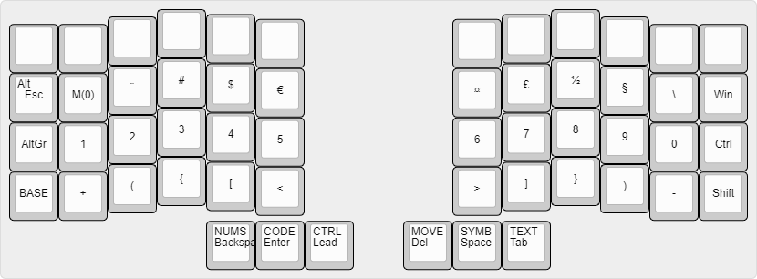
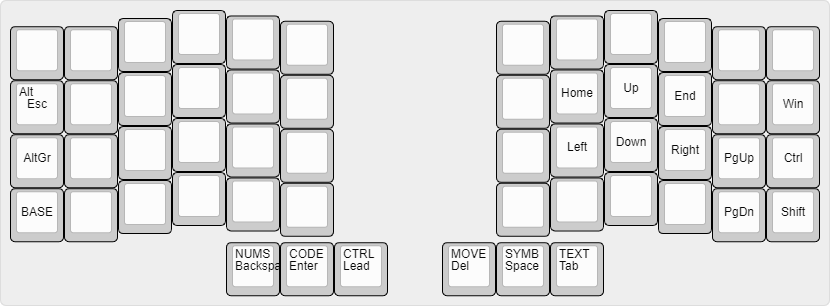
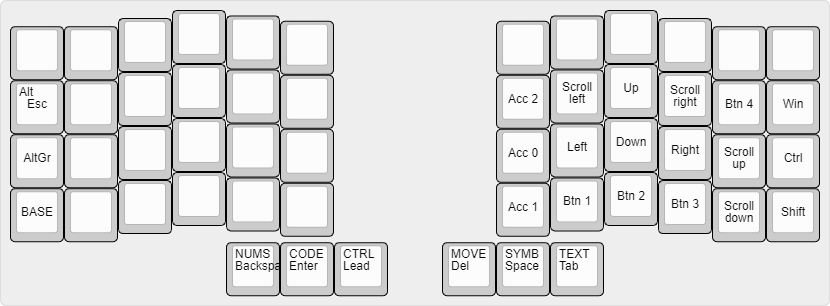
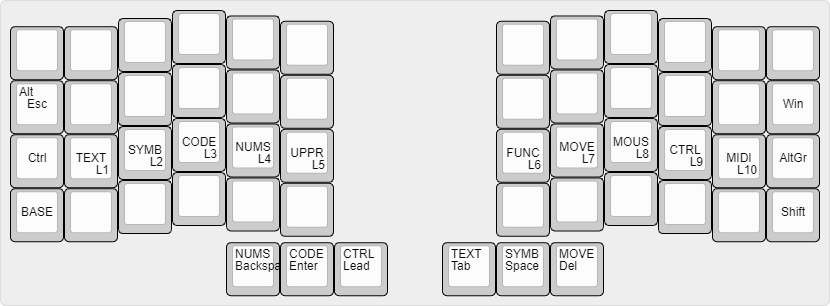
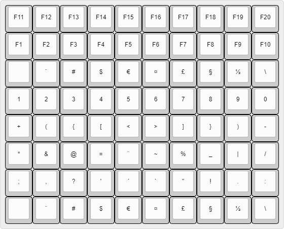

## Irisk - A swedish layout for lazy fingers
I wanted to see if it was a good idea to use a layout where movement of the writsts is traded for an extra keypress or two. So far I have not been able to test it extensively.

There are three general ideas in its design.

1) Statistically informed placement of characters.
2) Rolling window of symbols.
3) Logical symbol layout.

### A minimal Crkbd compatible layout

### The layers
#### How to read
The center of a key represents the symbol sent on keypress and release.

The upper left corner represents the activation of a layer or modifier key.

A layer is indicated by four capital letters.

#### Base

#### Text

#### Symbols

#### Code

#### Numbers

#### Move

#### Mouse

#### Control

### Matrix

#### Stuff
Images generated using [ww.keyboard-layout-editor.com](http://www.keyboard-layout-editor.com)
